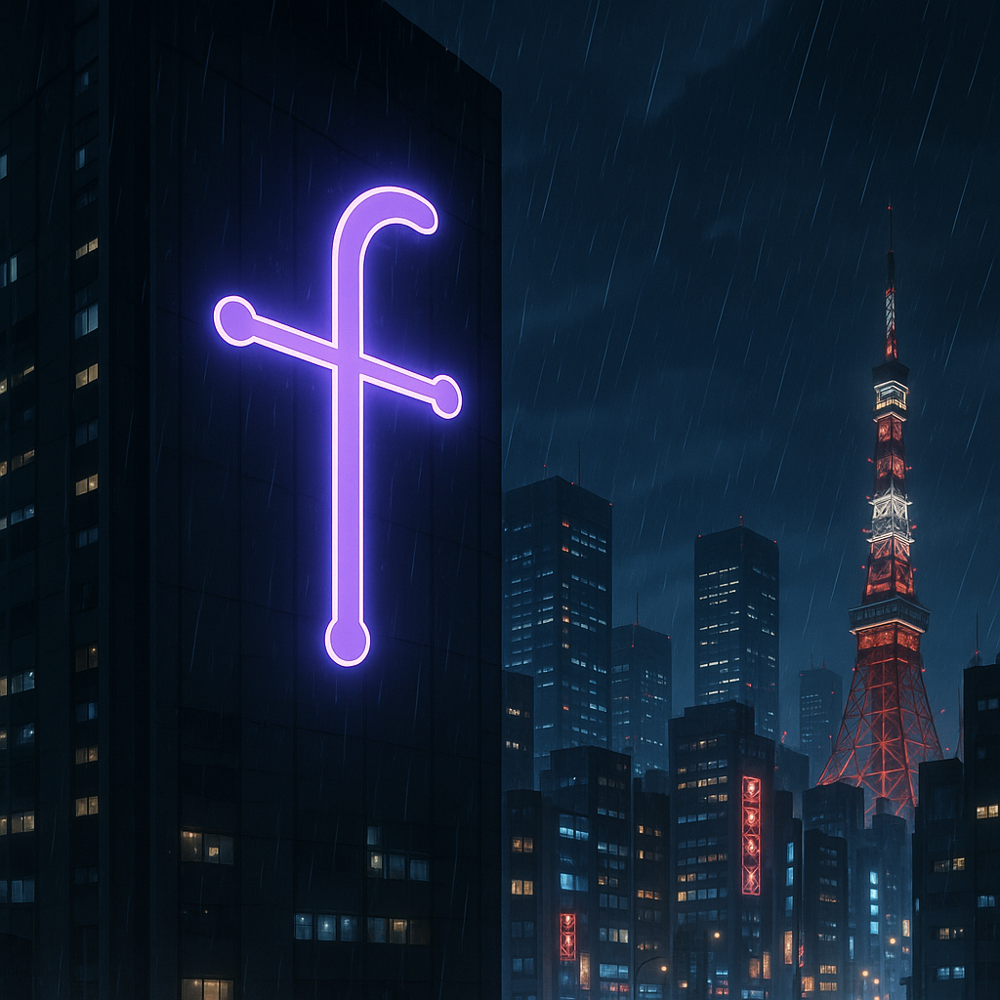
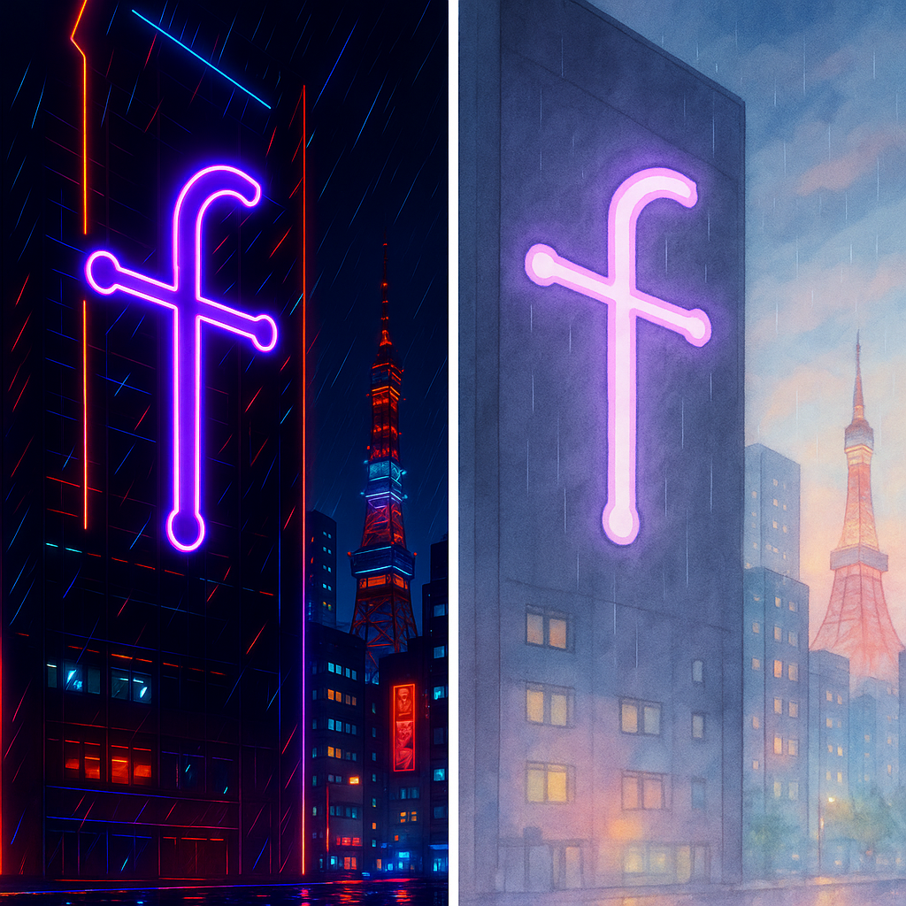
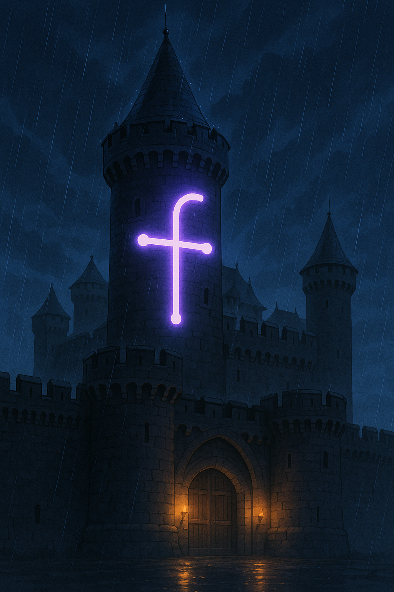

# Image MCP Servers

<div style="display: flex; justify-content: space-between; margin-bottom: 20px;">
  
  
  
</div>

This project implements an SSE MCP server that exposes tools for interacting with HuggingFace and Replicate APIs, focusing on image generation and model management. It's built using the MCP Core framework and provides a standardized interface for AI model interactions. Below is a guide to host it yourself!

## Features
<div>
  
  
</div>

### HuggingFace Integration

| Tool | Description |
|------|-------------|
| **Get Model Info** | Retrieve detailed information about models on HuggingFace |
| **Get Model Sample Images** | Extract sample images from model READMEs |
| **Get Readme** | Fetch the README content for a model |
| **Search Models** | Search for models on HuggingFace with filtering options |
| **WhoAmI** | Retrieve information about the current HuggingFace API token |

### Replicate Integration

| Tool | Description |
|------|-------------|
| **Generate Image** | Create images using Replicate's text-to-image models |
| **Get Model Info** | Retrieve detailed information about models on Replicate |
| **Get Prediction** | Check the status and retrieve outputs of a prediction |
| **List Models** | List available models on Replicate with optional filtering |
| **WhoAmI** | Retrieve information about the current Replicate API token |

## Getting Started

### Prerequisites
- Rust (2024 edition)
- Docker (optional, for containerized deployment)

### Installation

1. Clone the repository:
   ```bash
   git clone https://github.com/yourusername/image-mcp-servers.git
   cd image-mcp-servers
   ```

2. Create a `.env` file based on the `.env.example`:
   ```bash
   cp .env.example .env
   ```

3. Add your API tokens to the `.env` file:
   ```
   HF_API_TOKEN="your_huggingface_token"
   REPLICATE_API_TOKEN="your_replicate_token"
   ```

4. Build the project:
   ```bash
   cargo build
   ```

### Running the Server

```bash
cargo run
```

The server will start on the port specified in the `SERVER_PORT` environment variable (default: 3000).

### Using Docker

The project includes Docker support for easy deployment:

```bash
# Start the service
just docker-up service

# Stop the service
just docker-down service
```

## Configuration

The server can be configured using environment variables:

- `SERVER_NAME`: Name of the server (default: "image-mcp-servers")
- `SERVER_VERSION`: Version of the server (default: "0.1.0")
- `SERVER_PORT`: Port to run the server on (default: 3000)
- `HF_API_TOKEN`: HuggingFace API token
- `REPLICATE_API_TOKEN`: Replicate API token

## Features

The project supports two main feature sets that can be enabled or disabled:

- `huggingface`: Enables HuggingFace API integration
- `replicate`: Enables Replicate API integration

By default, no features are enabled. You can build with specific features:

```bash
# Build with only HuggingFace
cargo build --no-default-features --features huggingface

# Build with only Replicate
cargo build --no-default-features --features replicate
```

## License

This project is licensed under the MIT License - see the LICENSE file for details.

## Acknowledgements

- [MCP Core](https://github.com/stevohuncho/mcp-core) - The framework used for building this server
- [HuggingFace](https://huggingface.co/) - For their image generation models
- [Replicate](https://replicate.com/) - For their image generation API